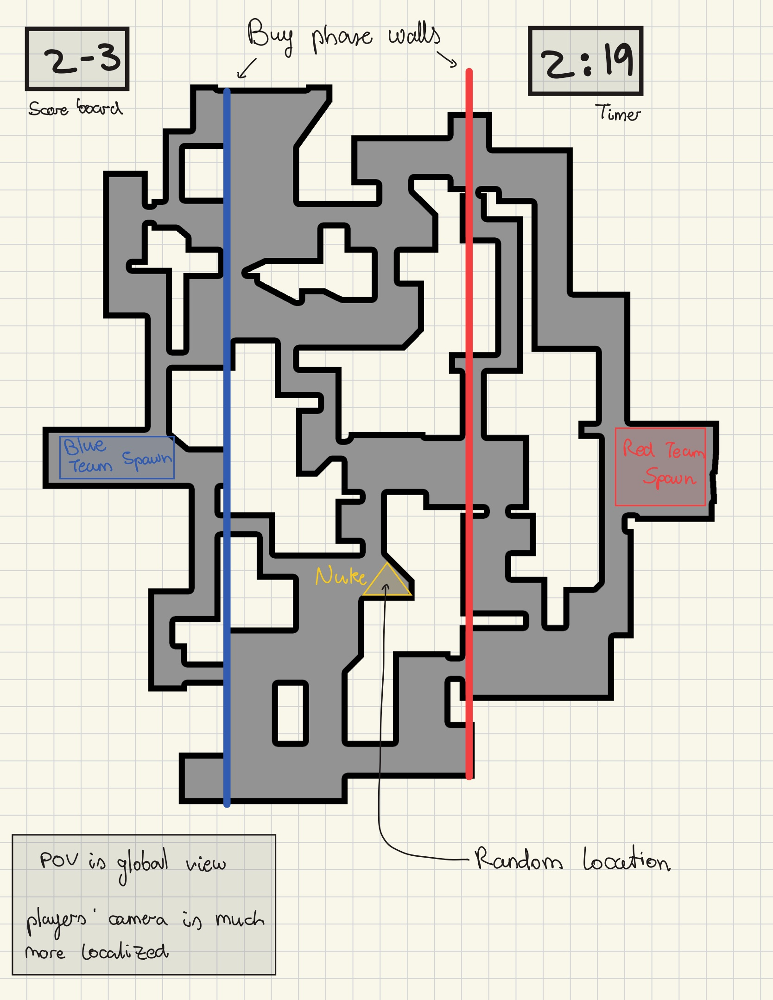

# Nuked - Project Proposal
by Alejandro Ojeda

## Elevator Pitch
A new world order is establishing. Two teams fight to defuse a nuke bomb that is threatening civilization. Team up, find the nuke, and dominate the map in fast, tactical 2D combat. Whatever you do, don't let the nuke explode.
## Game synopsis
Nuked is a 2D combat 3v3 shooter where teams have to fight to defuse a nuke. Each match consists of 11 time trial rounds. Rounds are won when the nuke is defused, which will make both teams progress to the next round. If no team manages to defuse the nuke, the nuke explodes and both teams lose the game. Each round will progressively decrease the time available to defuse the nuke. The team that scores 11 wining rounds first wins.

## Objective
- To win 11 rounds and prevent the nuke from exploding.
- To demonstrate game theory paradigm where a short term loss might help achieve a long term win.
## Mechanics
The main mechanic is shooting and moving around the map. Once the nuke is clear to defuse, the player will have to hold a button for 20 seconds to defuse the nuke.
## Mock-up

